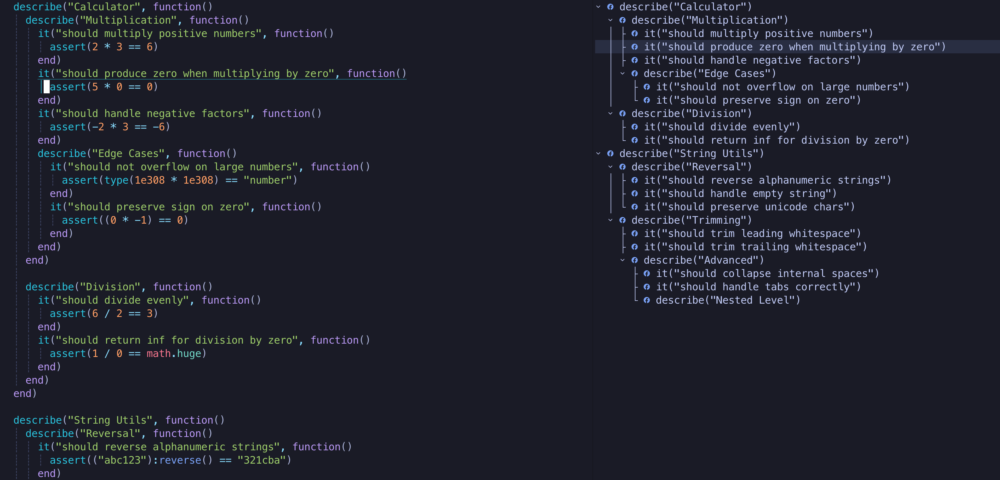

# outline-test-blocks-provider.nvim

A simple external provider for [outline.nvim](https://github.com/hedyhli/outline.nvim) that shows your test blocks, e.g., `describe(...)`, `it(...)`, etc calls in the Outline.



## Installation

### Using **lazy.nvim**

Modify your outline.nvim lazy spec to include the `outline-test-blocks-provider.nvim` dependency:

```lua
return {
  "hedyhli/outline.nvim",
  lazy = true,
  dependencies = {
    "bngarren/outline-test-blocks-provider.nvim",
  },
  cmd = { "Outline", "OutlineOpen" },
  keys = {
    { "<leader>o", "<cmd>Outline<CR>", desc = "Toggle outline" },
  },
  opts = {
    -- Add the "test_blocks" provider before "lsp"
    providers = {
      priority = { "test_blocks", "lsp", "coc", "markdown", "norg" },
      -- Configure the test_blocks provider here:
      test_blocks = {
        enable = { describe = true, it = true, pending = false },
        max_depth = 5,
      },
    },
  },
}
```

## Config

>[!NOTE]
>It defaults to activating only on `*_spec.lua` files. You can pass your own `supports_buffer(bufnr)` function to customize it to your liking

```lua
---@class test_blocks.Config
---
---Which test blocks to enable
---Default: { describe = true, it = true }
---@field enable? table<string, boolean>
---
---Whether to activate test_blocks provider for this buffer
---Default: any file ending with `_spec.lua`
---@field supports_buffer? function(bufnr: integer): boolean
---
---Max number of nested nodes to show in the outline
---Default: 5
---@field max_depth? integer
---
---Attempts to resize the outline sidebar for this provider
---Default: uses the global outline.nvim config
---@field sidebar_width? integer

M.defaults = {
	enable = { describe = true, it = true },
	max_depth = 5,
}
```

# Contributing

If you have feature suggestions or ideas, please feel free to open an issue on GitHub!

# Credits

Thanks to [@hedyhli](https://github.com/hedyhli) for an awesome [outline.nvim](https://github.com/hedyhli/outline.nvim) plugin!
